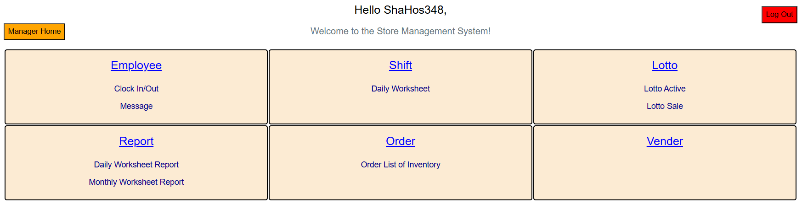

# Convenience Store Management Website



This is a store management website for convenience store branches, such as Junior Market LLC, created using Angular.js for frontend, Node.js for backend, and MySQL for database management.

## Features

- Admin Section for Database and Businesses Management
- Manager Section for Business Management
- Employee Clocking and Payroll
- Active Lottery and Sales Management
- Shift Report and Worksheet
- Item Inventory and Orderlist

## Run Locally

Clone the project

```bash
  git clone https://github.com/ShaHos348/JuniorM
```

Go to the 2 directories Frontend and Backend on seperate terminals

```bash
  cd Frontend
```
```bash
  cd Backend
```

Install dependencies in both

```bash
  npm install
```

In MySQL, set up a connection and run the StoreDatabaseSchema.sql file to set up the database (will be empty). Add an entry to the admin table to be able to add businesses. 

In the backend directory, create a .env file with the variables and values (depending on your configurations):
PORT, DB_PORT, DB_HOST, DB_USER, DB_PASSWORD, DB_NAME, and NODE_ENV

Start both servers

```bash
  npm start
```


